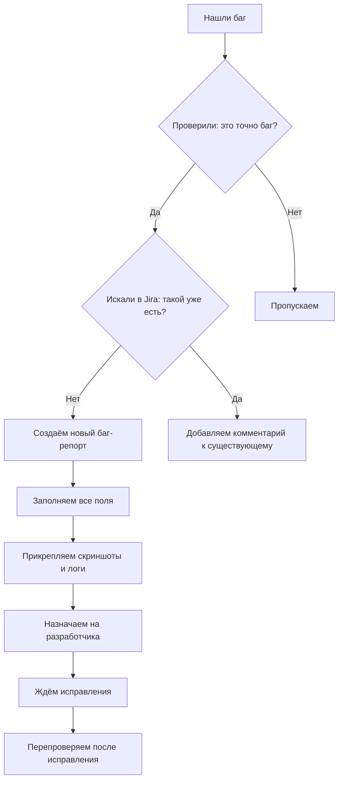

---

### Урок 3. Баг-репорты и Jira

```markdown
# Урок 3. Баг-репорты и Jira

!!! info "Цель урока"
    Научиться находить баги, правильно их оформлять и заводить в Jira — главном инструменте тестировщика.

---

## Как найти баг?

**Баг** — это любое расхождение между ожидаемым и фактическим поведением. Но не каждое расхождение — это баг. Иногда это фича.

!!! tip "Баг или фича?"
    **Баг:** Кнопка "Оплатить" не нажимается → пользователь не может купить товар.
    
    **Фича:** На сайте нет кнопки "Удалить аккаунт" → так задумано, нужно писать в поддержку.
    
    Если сомневаетесь — спросите аналитика или менеджера.

### Где искать баги?

| Область | Что проверять |
|:--------|:--------------|
| **Функциональность** | Работает ли кнопка, форма, переход по ссылке |
| **Валидация** | Принимает ли поле некорректные данные (буквы в номере телефона) |
| **Границы** | Что будет, если ввести -1, 0, 999999999 |
| **Интерфейс** | Не съезжает ли вёрстка на мобильном, не перекрываются ли элементы |
| **Логика** | Можно ли оформить заказ с пустой корзиной |

---

## Как оформить баг-репорт

Хороший баг-репорт — это такой, который разработчик поймёт с первого раза и не вернёт вам с вопросом "а что тут не так?".

### Структура идеального баг-репорта

| Поле | Что писать | Пример |
|:-----|:-----------|:-------|
| **Заголовок** | Кратко: что, где и при каких условиях | "Кнопка Войти неактивна при корректном логине и пароле" |
| **Окружение** | Устройство, браузер, версия ОС | iPhone 14, Safari 16.4, iOS 16.3 |
| **Шаги** | Пошагово, что делали | 1. Открыть сайт 2. Ввести логин 3. Ввести пароль 4. Нажать Войти |
| **Ожидаемый результат** | Что должно было произойти | Пользователь попадает в личный кабинет |
| **Фактический результат** | Что произошло на самом деле | Кнопка "Войти" не реагирует на нажатие, авторизация не происходит |
| **Приоритет** | Насколько срочно чинить | High, Medium, Low |
| **Серьёзность** | Насколько критичен для продукта | Blocker, Critical, Major, Minor |
| **Вложения** | Скриншот, видео, логи | `bug_login_button.mp4` |

### Пример плохого vs хорошего баг-репорта

!!! failure "Плохой баг-репорт"
    **Заголовок:** Не работает вход
    
    **Описание:** Захожу на сайт, ввожу данные, а оно не пускает. Почините срочно!!!
    
    *Разработчик потратит час, чтобы понять, что именно не так.*

!!! success "Хороший баг-репорт"
    **Заголовок:** Кнопка "Войти" не реагирует на нажатие в Chrome 115
    
    **Окружение:** Windows 10, Chrome 115.0
    
    **Шаги:**
    1. Открыть https://example-shop.ru/login
    2. Ввести логин: `testuser@mail.ru`
    3. Ввести пароль: `Qwerty123!`
    4. Нажать кнопку "Войти"
    
    **Ожидаемый результат:** Пользователь авторизуется и попадает на главную страницу личного кабинета.
    
    **Фактический результат:** Кнопка "Войти" визуально нажимается, но ничего не происходит. Авторизация не выполняется. Ошибка в консоли: `Uncaught TypeError: Cannot read properties of null`.
    
    **Приоритет:** High
    **Серьёзность:** Blocker (пользователи не могут войти)
    
    **Вложения:** [Скриншот ошибки в консоли](), [Видео воспроизведения бага]()
    
    *Разработчик поймёт проблему за 30 секунд.*

---

## Jira для тестировщика

**Jira** — это система управления задачами, в которой живут баг-репорты, задачи на разработку и улучшения.

### Как завести баг в Jira


Основные поля при создании бага в Jira
```mermaid
Поле	    Что выбрать
Тип задачи	Bug
Проект	    Название вашего продукта
Заголовок	Краткое описание (см. пример выше)
Приоритет	High / Medium / Low
Серьёзность	Blocker / Critical / Major / Minor / Trivial
Описание	Шаги, ожидаемый и фактический результат
Версия	    Версия приложения, где найден баг
Исполнитель	Разработчик (или оставить пустым для распределения)
Приложение	Скриншоты, видео, логи
```

Приоритет и серьёзность: в чём разница?
!!! warning "Частая путаница"
Серьёзность — насколько критичен баг для продукта (Blocker → всё стоит, Minor → мелочь).

Приоритет — насколько срочно нужно чинить (High → сегодня, Low → когда-нибудь).

Они не всегда совпадают!

```mermaid
Ситуация	                    Серьёзность	    Приоритет	Почему
Кнопка "Купить" не работает	    Blocker	        High	    Деньги не поступают
Опечатка в тексте на главной	Minor	        High	    Портал крупный, имидж важен
Баг в админке для 1 сотрудника	Major	        Low	        Пользователи не видят, можно отложить
Логотип съехал в футере	        Minor	        Low	        Никому не мешает
```
Ключевые термины урока
!!! abstract "Глоссарий"

Баг-репорт — документ, описывающий дефект (шаги, ожидание, факт, окружение).

Jira — самый популярный баг-трекинговый инструмент в мире.

Приоритет — срочность исправления (High, Medium, Low).

Серьёзность — степень влияния на продукт (Blocker, Critical, Major, Minor).

Окружение — устройство, браузер, ОС, версия приложения.

Задание
!!! question "Практика"

Заведите 3 баг-репорта
Используя чек-лист из прошлого урока, найдите 3 бага на сайте интернет-магазина и оформите их по шаблону:

Для каждого бага заполните:
```mermaid
Поле	                Ваш ответ
Заголовок	
Окружение	
Шаги	
Ожидаемый результат	
Фактический результат	
Приоритет	
Серьёзность	
Скриншот	            Приложить
```
!!! tip "Критерии оценки"

3 балла — баг-репорты понятны, заполнены все поля

4 балла — всё выше + правильно определены приоритет и серьёзность

5 баллов — всё выше + есть скриншоты/видео + разработчик поймёт с первого взгляда

Присылайте баг-репорты в чат ментору.

!!! success "Поздравляю!"
Вы прошли Модуль 1! Теперь вы умеете:

✅ Находить баги и оформлять их по стандартам индустрии

✅ Работать с Jira — главным инструментом тестировщика

✅ Определять приоритет и серьёзность бага

✅ Составлять чек-листы на основе классов эквивалентности и границ

В следующем модуле — Инструменты тестировщика: освоим Postman, Charles Proxy и SQL для реальных проектов.